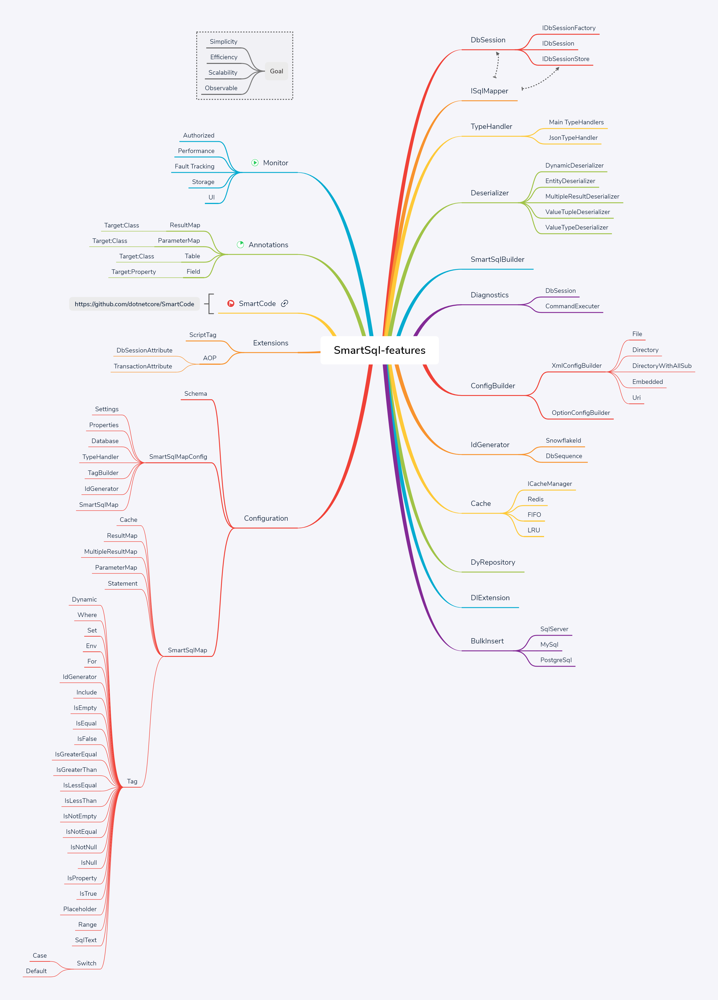
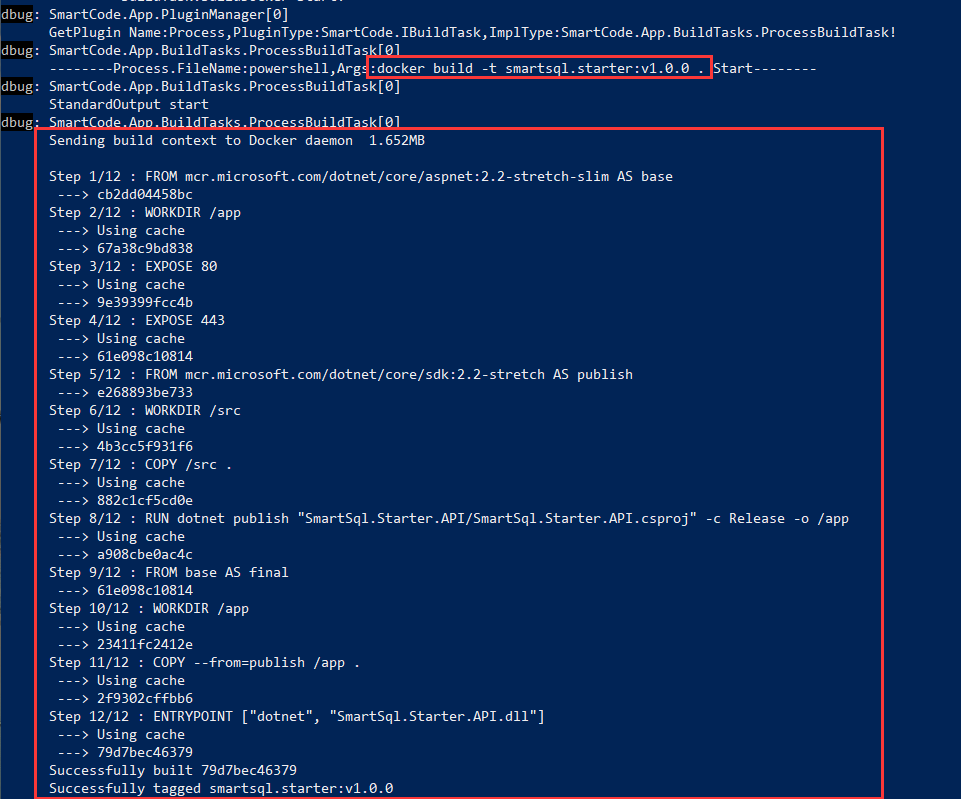
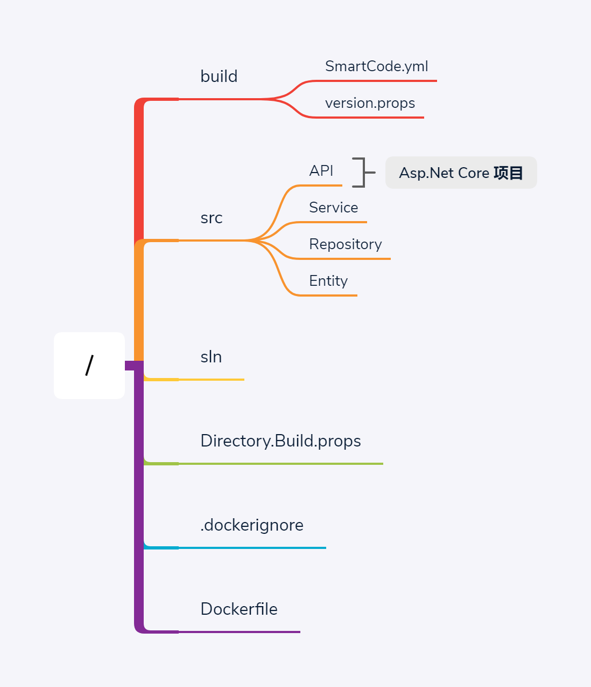
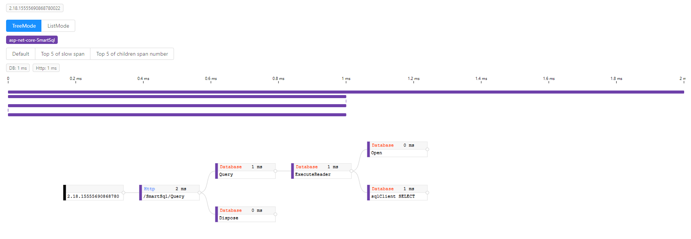
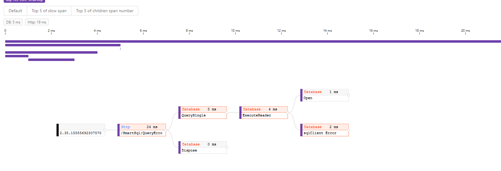
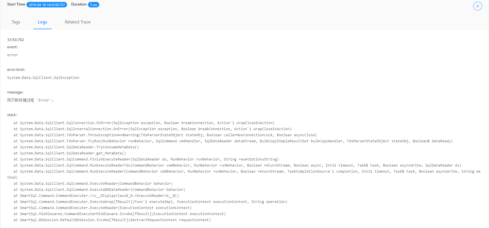

# Introduced

> SmartSql = MyBatis + Cache(Memory | Redis) + R/W Splitting +Dynamic Repository + Diagnostics ......
---
> Simple, efficient, high-performance, scalable, monitoring, progressive development!

## How does she work?

SmartSql draws on MyBatis's ideas, uses XML to manage SQL, and provides several filter tags to eliminate various if/else judgment branches at the code level. 
SmartSql will manage your SQL and filter the tags to maintain your various conditional judgments at the code level to make your code more beautiful.

## Why Choose SmartSql?

The Orm,linq of the DotNet system, which is mostly Linq, is very good, eliminating the developer's reliance on SQL. But it ignores the fact that SQL itself is not complex, and that it is difficult for developers to write Linq to generate good performance SQL in complex query scenarios, and I believe that students who have used EF must have this experience: "I think about how SQL writes, and then I write Linq, It's over. You may also want to see what SQL output of Linq is like. " It was a very bad experience. To be absolutely optimized for SQL, developers must have absolute control over SQL. In addition, SQL itself is very simple, why add a layer of translators?

> SmartSql has been out of formal open source for more than two years, in the production environment after several micro-service verification.
> There are also some businesses that are using SmartSql (if you are also using SmartSql Welcome to submit issue)[Who is using SmartSql](https://github.com/dotnetcore/SmartSql/issues/13).
> Has now joined [NCC](https://github.com/dotnetcore)。
> The future ([Roadmap-2019](https://github.com/dotnetcore/SmartSql/issues/47))  SmartSql will continue to add new features to help developers improve efficiency. Welcome to submit Issue <https://github.com/dotnetcore/SmartSql/issues>.

## So why not Dapper, or DbHelper?

Dapper is really good and good performance, but the code that will be ceded to you is filled with SQL and various judgment branches that will make code maintenance difficult to read and maintain. In addition, Dapper only provides DataReader to Entity anti-serialization function. And SmartSql offers a number of features to improve developer efficiency.

## Feature Overview



## Dynamic Repository

Dynamic Agent Repository (SmartSql.DyRepository) components are SmartSql very unique features that simplify the use of SmartSql. There is little intrusion into the business code. It can be said that using ISqlMapper is the original method, and DyRepository automatically helps you implement these methods.

DyRepository only need to define the Repository interface, through a simple configuration can automatically implement these interfaces and register in the IoC container, when used injection instant acquisition implementation. The principle is to obtain the Scope and SqlId in the XML file of SmartSql through the naming rules of the interface and interface method, use the parameters of the interface method as the Request, and automatically judge the query or perform the operation through the SQL in the XML, and finally realize the ISqlMapper Call.

### 0. Define Repository interfaces

``` csharp
    public interface IUserRepository : IRepository<User, long>
    {
    }
```

### 1. Injection dependencies

``` csharp
            services.AddSmartSql()
                .AddRepositoryFromAssembly(options => { options.AssemblyString = "SmartSql.Starter.Repository"; });
```

### 2. Use

``` csharp
    public class UserService
    {
        IUserRepository userRepository;

        public UserService(IUserRepository userRepository)
        {
            this.userRepository = userRepository;
        }
    }
```

## SmartSql Best practices -> [SmartCode](https://github.com/dotnetcore/SmartCode)


By [SmartCode](https://github.com/dotnetcore/SmartCode) Developers simply configure the database connection to build everything that is required for the solution, including, but not limited to:

- Solution Engineering
- Give you a restore.

``` yml
  ReStore:
    Type: Process
    Parameters: 
      FileName: powershell
      WorkingDirectory: '{{Project.Output.Path}}'
      Args: dotnet restore
```

- Docker
  - Building Docker Mirroring & Running Instances

``` yml
 BuildDocker:
    Type: Process
    Parameters:
      FileName: powershell
      WorkingDirectory: '{{Project.Output.Path}}'
      Args: docker build -t {{Project.Parameters.DockerImage}}:v1.0.0 .

  RunDocker:
    Type: Process
    Parameters:
      FileName: powershell
      WorkingDirectory: '{{Project.Output.Path}}'
      Args: docker run --name {{Project.Parameters.DockerImage}} --rm -d -p 8008:80 {{Project.Parameters.DockerImage}}:v1.0.0 .
```

- Open a browser by the way

``` yml
  RunChrome:
    Type: Process
    Parameters:
      FileName: C:\Program Files (x86)\Google\Chrome\Application\chrome.exe
      CreateNoWindow: false
      Args: http://localhost:8008/swagger
```

### Docker




### Directory structure generated by SmartCode



## Read and write separation

SmartSql Read and write separation is especially easy, just provide a good configuration can be:

``` xml
  <Database>
    <DbProvider Name="PostgreSql"/>
    <Write Name="WriteDB" ConnectionString="${Master}"/>
    <Read Name="ReadDb-1" ConnectionString="${Slave-0}" Weight="100"/>
    <Read Name="ReadDb-2" ConnectionString="${Slave-1}" Weight="100"/>
  </Database>
```

## Cache

- Lru Least recently used algorithms
- Fifo Advanced first-out algorithm
- RedisCacheProvider
- Other inherited self-ICacheProvider cache types are available

``` xml
<Caches>
    <Cache Id="LruCache" Type="Lru">
      <Property Name="CacheSize" Value="10"/>
      <FlushOnExecute Statement="AllPrimitive.Insert"/>
      <FlushInterval Hours="1" Minutes="0" Seconds="0"/>
    </Cache>
    <Cache Id="FifoCache" Type="Fifo">
      <Property Name="CacheSize" Value="10"/>
    </Cache>
    <Cache Id="RedisCache" Type="${RedisCacheProvider}">
      <Property Name="ConnectionString" Value="${Redis}" />
      <FlushInterval Seconds="60"/>
    </Cache>
  </Caches>
   <Statement Id="QueryByLruCache"  Cache="LruCache">
      SELECT Top 6 T.* From T_User T;
    </Statement>
```

## Type Handler

The SmartSql is implemented internally DotNet the main types of type handlers, and some types of compatible type conversion processors are provided, as well as more commonly used JsonTypeHanlder.

``` xml
    <TypeHandler PropertyType="SmartSql.Test.Entities.UserInfo,SmartSql.Test" Type="${JsonTypeHandler`}">
      <Properties>
        <Property Name="DateFormat" Value="yyyy-MM-dd mm:ss"/>
        <Property Name="NamingStrategy" Value="Camel"/>
      </Properties>
    </TypeHandler>
```

## CUD Code generation

SmartSql also provides CUD extension functions to help developers generate good CUD-SQL for direct developer use without having to write any configuration.

``` csharp
public static TEntity GetById<TEntity, TPrimaryKey>(this ISqlMapper);
public static TPrimaryKey Insert<TEntity, TPrimaryKey>(this ISqlMapper sqlMapper, TEntity entity);
public static int DyUpdate<TEntity>(this ISqlMapper sqlMapper, object entity);
public static int Update<TEntity>(this ISqlMapper sqlMapper, TEntity entity);
public static int DeleteById<TEntity, TPrimaryKey>(this ISqlMapper sqlMapper, TPrimaryKey id);
public static int DeleteMany<TEntity, TPrimaryKey>(this ISqlMapper sqlMapper, IEnumerable<TPrimaryKey> ids);
```

## Id Generator

### SnowflakeId

``` xml
<IdGenerators>
    <IdGenerator Name="SnowflakeId" Type="SnowflakeId">
      <Properties>
        <Property Name="WorkerIdBits" Value="10"/>
        <Property Name="WorkerId" Value="888"/>
        <Property Name="Sequence" Value="1"/>
      </Properties>
    </IdGenerator>
</IdGenerators>
```

``` xml
    <Statement Id="Insert">
      <IdGenerator Name="SnowflakeId" Id="Id"/>
      INSERT INTO T_UseIdGenEntity
      (
      Id,
      Name
      )
      VALUES
      (
      @Id,
      @Name
      );
      Select @Id;
    </Statement>
```

``` csharp
var id = SqlMapper.ExecuteScalar<long>(new RequestContext
            {
                Scope = nameof(UseIdGenEntity),
                SqlId = "Insert",
                Request = new UseIdGenEntity()
                {
                    Name = "SmartSql"
                }
            });
```

### DbSequence

``` xml
<IdGenerators>
    <IdGenerator Name="DbSequence" Type="DbSequence">
      <Properties>
        <Property Name="Step" Value="10"/>
        <Property Name="SequenceSql" Value="Select Next Value For IdSequence;"/>
      </Properties>
    </IdGenerator>
</IdGenerators>

```

``` xml
    <Statement Id="InsertByDbSequence">
      <IdGenerator Name="DbSequence" Id="Id"/>
      INSERT INTO T_UseIdGenEntity
      (
      Id,
      Name
      )
      VALUES
      (
      @Id,
      @Name
      );
      Select @Id;
    </Statement>
```

``` csharp
            var id = SqlMapper.ExecuteScalar<long>(new RequestContext
            {
                Scope = nameof(UseIdGenEntity),
                SqlId = "InsertByDbSequence",
                Request = new UseIdGenEntity()
                {
                    Name = "SmartSql"
                }
            });
```

## AOP Transaction

``` csharp
        [Transaction]
        public virtual long AddWithTran(User user)
        {
            return _userRepository.Insert(user);
        }
```

### Transaction nesting

> When a transaction is nested, the transaction attribute annotation of the child function is no longer turned on, and the transaction that calls the function by the parent is used instead

``` csharp
        [Transaction]
        public virtual long AddWithTranWrap(User user)
        {
            return AddWithTran(user);
        }
```

## BulkInsert

``` csharp
using (var dbSession= SqlMapper.SessionStore.Open())
            {
                var data = SqlMapper.GetDataTable(new RequestContext
                {
                    Scope = nameof(AllPrimitive),
                    SqlId = "Query",
                    Request = new { Taken = 100 }
                });
                data.TableName = "T_AllPrimitive";
                IBulkInsert bulkInsert = new BulkInsert(dbSession);
                bulkInsert.Table = data;
                bulkInsert.Insert();
            }
```

## Skywalking Monitoring

SmartSql currently supports Skywalking monitoring and is enabled by installing the [SkyAPM-dotnet](https://github.com/SkyAPM/SkyAPM-dotnet) agent. The following is a partial screenshot.

### Monitoring execution commands



### View whether the cache is cached and the number of records returned


### View executed SQL statements


### Transaction


### Error



### Exception stack Trace



## Nuget Packages

| Package | NuGet Stable |  Downloads |
| ------- | -------- | ------- |
| [SmartSql](https://www.nuget.org/packages/SmartSql/) | [](https://www.nuget.org/packages/SmartSql/)  | [](https://www.nuget.org/packages/SmartSql/) |
| [SmartSql.Schema](https://www.nuget.org/packages/SmartSql.Schema/) | [](https://www.nuget.org/packages/SmartSql.Schema/)  | [](https://www.nuget.org/packages/SmartSql.Schema/) |
| [SmartSql.TypeHandler](https://www.nuget.org/packages/SmartSql.TypeHandler/) | [](https://www.nuget.org/packages/SmartSql.TypeHandler/)  | [](https://www.nuget.org/packages/SmartSql.TypeHandler/) |
| [SmartSql.DyRepository](https://www.nuget.org/packages/SmartSql.DyRepository/) | [](https://www.nuget.org/packages/SmartSql.DyRepository/)  | [](https://www.nuget.org/packages/SmartSql.DyRepository/) |
| [SmartSql.DIExtension](https://www.nuget.org/packages/SmartSql.DIExtension/) | [](https://www.nuget.org/packages/SmartSql.DIExtension/)  | [](https://www.nuget.org/packages/SmartSql.DIExtension/) |
| [SmartSql.Cache.Redis](https://www.nuget.org/packages/SmartSql.Cache.Redis/) | [](https://www.nuget.org/packages/SmartSql.Cache.Redis/)  | [](https://www.nuget.org/packages/SmartSql.Cache.Redis/) |
| [SmartSql.ScriptTag](https://www.nuget.org/packages/SmartSql.ScriptTag/) | [](https://www.nuget.org/packages/SmartSql.ScriptTag/)  | [](https://www.nuget.org/packages/SmartSql.ScriptTag/) |
| [SmartSql.AOP](https://www.nuget.org/packages/SmartSql.AOP/) | [](https://www.nuget.org/packages/SmartSql.AOP/)  | [](https://www.nuget.org/packages/SmartSql.AOP/) |
| [SmartSql.Options](https://www.nuget.org/packages/SmartSql.Options/) | [](https://www.nuget.org/packages/SmartSql.Options/)  | [](https://www.nuget.org/packages/SmartSql.Options/) |
| [SmartSql.Bulk](https://www.nuget.org/packages/SmartSql.Bulk/) | [](https://www.nuget.org/packages/SmartSql.Bulk/)  | [](https://www.nuget.org/packages/SmartSql.Bulk/) |
| [SmartSql.Bulk.SqlServer](https://www.nuget.org/packages/SmartSql.Bulk.SqlServer/) | [](https://www.nuget.org/packages/SmartSql.Bulk.SqlServer/)  | [](https://www.nuget.org/packages/SmartSql.Bulk.SqlServer/) |
| [SmartSql.Bulk.PostgreSql](https://www.nuget.org/packages/SmartSql.Bulk.PostgreSql/) | [](https://www.nuget.org/packages/SmartSql.Bulk.PostgreSql/)  | [](https://www.nuget.org/packages/SmartSql.Bulk.PostgreSql/)
| [SmartSql.Bulk.MySql](https://www.nuget.org/packages/SmartSql.Bulk.MySql/) | [](https://www.nuget.org/packages/SmartSql.Bulk.MySql/)  | [](https://www.nuget.org/packages/SmartSql.Bulk.MySql/) |
| [SmartSql.Bulk.MySqlConnector](https://www.nuget.org/packages/SmartSql.Bulk.MySqlConnector/) | [](https://www.nuget.org/packages/SmartSql.Bulk.MySqlConnector/)  | [](https://www.nuget.org/packages/SmartSql.Bulk.MySqlConnector/) |